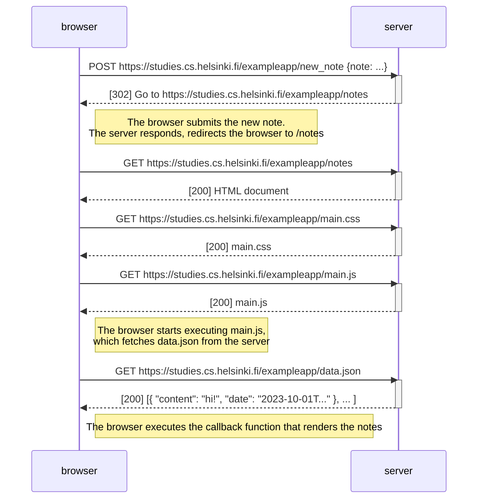

```mermaid
sequenceDiagram
    participant browser
    participant server

    browser->>server: POST https://studies.cs.helsinki.fi/exampleapp/new_note {note: ...}
    activate server
    server-->>browser: [302] Go to https://studies.cs.helsinki.fi/exampleapp/notes
    deactivate server

    Note right of browser: The browser submits the new note. <br/> The server responds, redirects the browser to /notes

    browser->>server: GET https://studies.cs.helsinki.fi/exampleapp/notes
    activate server
    server-->>browser: [200] HTML document
    deactivate server

    browser->>server: GET https://studies.cs.helsinki.fi/exampleapp/main.css
    activate server
    server-->>browser: [200] main.css
    deactivate server

    browser->>server: GET https://studies.cs.helsinki.fi/exampleapp/main.js
    activate server
    server-->>browser: [200] main.js
    deactivate server

    Note right of browser: The browser starts executing main.js,<br/> which fetches data.json from the server

    browser->>server: GET https://studies.cs.helsinki.fi/exampleapp/data.json
    activate server
    server-->>browser: [200] [{ "content": "hi!", "date": "2023-10-01T..." }, ... ]
    deactivate server

    Note right of browser: The browser executes the callback function that renders the notes
```
