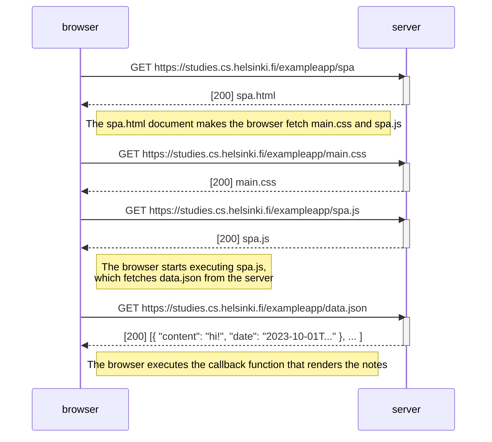

```mermaid
sequenceDiagram
    participant browser
    participant server

    browser->>server: GET https://studies.cs.helsinki.fi/exampleapp/spa
    activate server
    server-->>browser: [200] spa.html
    deactivate server

    Note right of browser: The spa.html document makes the browser fetch main.css and spa.js

    browser->>server: GET https://studies.cs.helsinki.fi/exampleapp/main.css
    activate server
    server-->>browser: [200] main.css
    deactivate server

    browser->>server: GET https://studies.cs.helsinki.fi/exampleapp/spa.js
    activate server
    server-->>browser: [200] spa.js
    deactivate server

    Note right of browser: The browser starts executing spa.js,<br/> which fetches data.json from the server

    browser->>server: GET https://studies.cs.helsinki.fi/exampleapp/data.json
    activate server
    server-->>browser: [200] [{ "content": "hi!", "date": "2023-10-01T..." }, ... ]
    deactivate server

    Note right of browser: The browser executes the callback function that renders the notes
```
