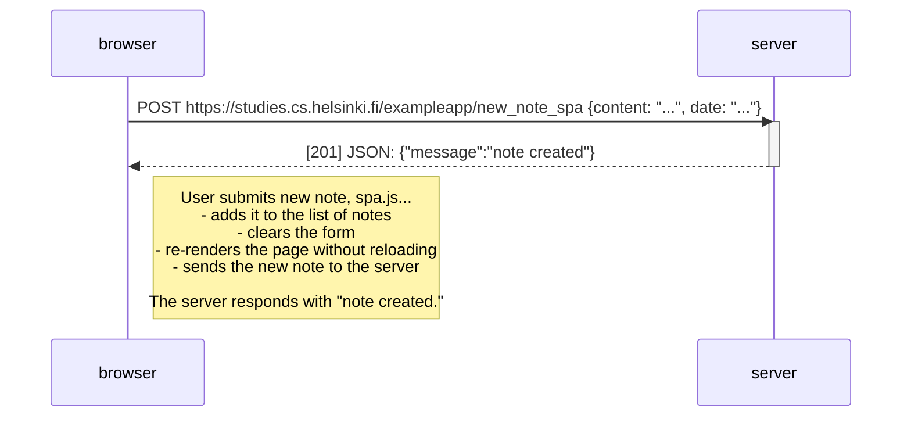

```mermaid
sequenceDiagram
    participant browser
    participant server

    browser->>server: POST https://studies.cs.helsinki.fi/exampleapp/new_note_spa {content: "...", date: "..."}
    activate server
    server-->>browser: [201] JSON: {"message":"note created"}
    deactivate server

    Note right of browser: User submits new note, spa.js...<br> - adds it to the list of notes <br> - clears the form <br> - re-renders the page without reloading <br> - sends the new note to the server <br><br> The server responds with "note created."
```
